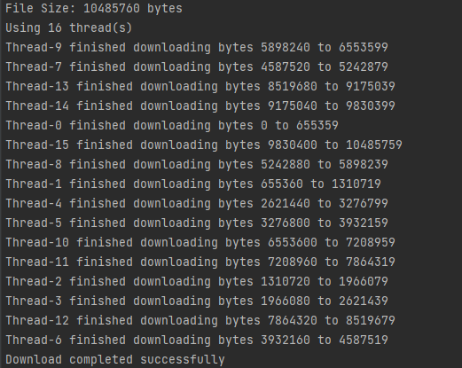

# Multithreaded File Downloader (Java)

## Overview
This project is a simple **multithreaded file downloader** written in Java.  
It demonstrates how to use threads (`Runnable`) to download different parts of a file concurrently and merge them into a single output file.

This project is a **demo application** created for **learning purposes**. It showcases how to use **multithreading** in Java along with **basic exception handling**.

The downloader:
- Splits the file into chunks based on the number of available CPU cores.
- Starts multiple threads, each downloading a specific byte range.
- Writes directly into the correct position of the output file using `RandomAccessFile`.
- Falls back to single-threaded download if the server does not support `Range` requests.
- Retries failed chunks up to 3 times.

---

## Requirements
- Java 11 or higher (tested with OpenJDK).
- Internet connection.
- A server that supports `Content-Length` and `Range` requests (e.g., ThinkBroadband or Tele2 speed test servers).

---

## How to Compile and Run

1. Save the source code in a file named:
2. Compile:
```
javac MultithreadDownloader.java
```
3.Run
```
java MultithreadDownloader
```

## Code Structure
```MultithreadDownloader```
- Main class that calculates file size, determines thread count, and starts download tasks.
- Checks if the server supports multi-threaded downloads (Accept-Ranges header).
- Falls back to single-thread download if needed.
- DownloadTask

```Download Task```
- Implements Runnable.
- Each thread downloads a specific byte range from the file.
- Writes data directly into the correct position of the output file.
- Retries up to 3 times if a chunk fails.

## Notes
- If the server does not support Range requests, the program will automatically switch to  single-threaded mode.
- If getContentLengthLong() returns -1, the file size cannot be determined in advance.

- Large files may take longer depending on your internet speed.

## 🌐 Example Test URLs

You can use these reliable servers to test the downloader:

- [10MB file – ThinkBroadband](http://ipv4.download.thinkbroadband.com/10MB.zip)
- [10MB file – Tele2](http://speedtest.tele2.net/10MB.zip)
- [100MB file – Tele2](http://speedtest.tele2.net/100MB.zip)


## Example Output
```
File Size: 10485760 bytes
Using 8 thread(s)
Thread-0 finished downloading bytes 0 to 1310719
Thread-1 finished downloading bytes 1310720 to 2621439
...
Download completed successfully

2) 

```

## Future Improvement
- Add command-line arguments for URL and output file name.
- Support HTTPS with custom SSL handling.
- Add progress bar and percentage completion.
- Resume interrupted downloads.

----